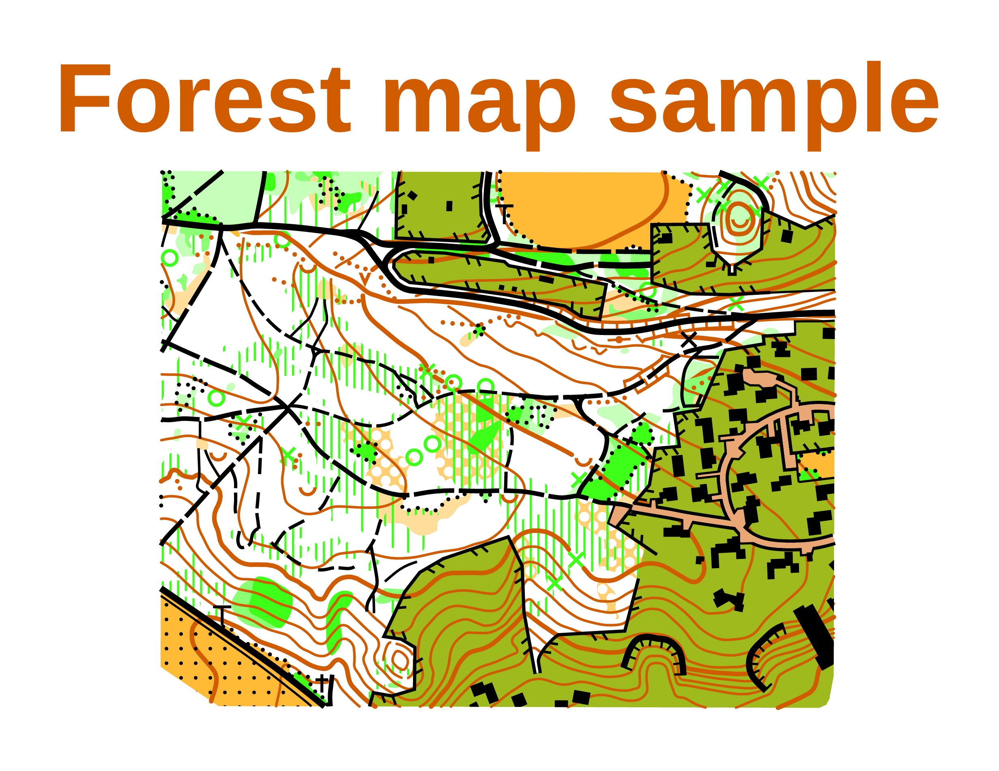
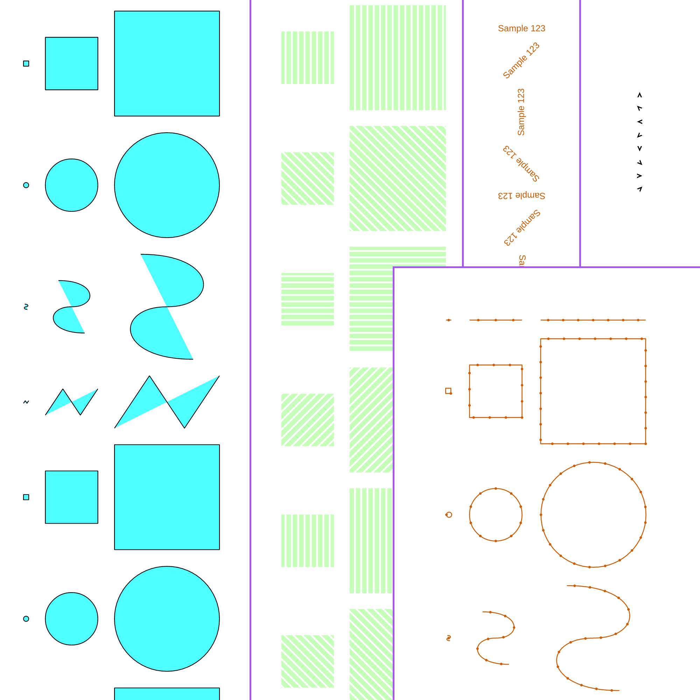
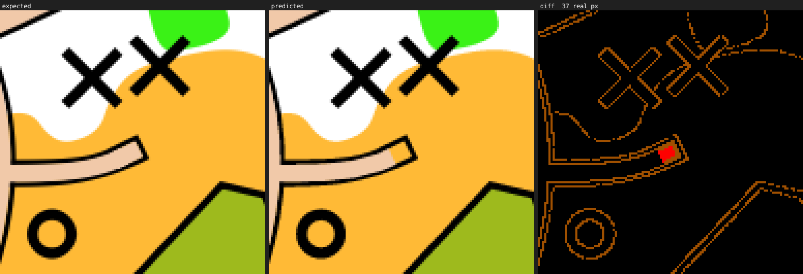
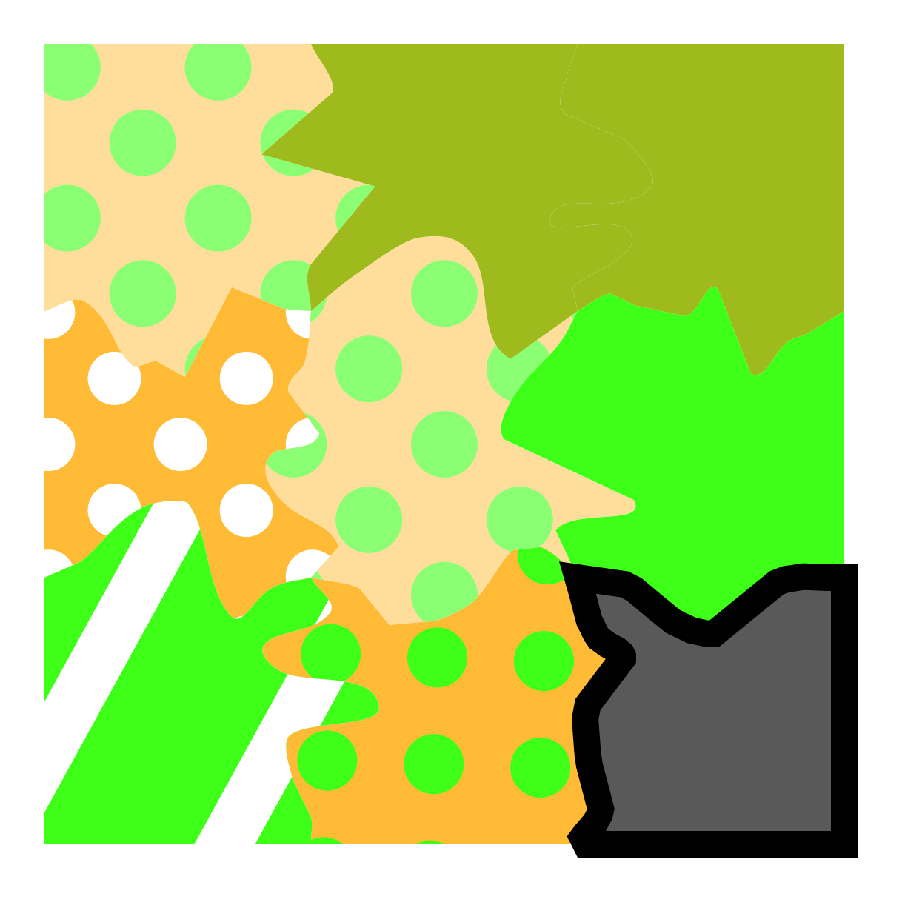

# MaUR-O

[][crate]
[](https://github.com/Noce99/MaUR-O/actions/workflows/ci.yml)

This is a **Ma**p **U**tils project written in **R**ust for **O**rienteering.


*The ground-truth renderer's output (left) side by side with MaUR-O's own rendering of the same map (right). Map: Valserena, owned by [Polisportiva Masi](https://www.polmasi.it/attivita_sportive/palestra/orienteering.it.html) and made by [Samuele Curzio](https://mapsamthing.com/en/) and [Remo Madella](https://www.remmaps.it/).*

It renders [OpenOrienteering Mapper](https://www.openorienteering.org/apps/mapper/)
`.omap`/`.xmap` files to raster images (PNG, BMP, TIFF, JPEG) from the command
line, without needing Mapper itself, Qt, or a graphical environment installed.
Alongside the renderer, it ships a small pair of benchmarking tools that build
and run suites of maps to measure how closely the renderer's output matches a
ground-truth reference — useful both for tracking rendering fidelity over time
and for spotting real regressions among the noise two rasterizers naturally
disagree on — and a generator that makes random maps out of an existing symbol
set, for when the maps that exist are not enough.

## Table of Contents

- [Installation](#installation)
  - [Fonts and fontconfig](#fonts-and-fontconfig)
- [Usage](#usage)
  - [`map_to_image`](#map_to_image)
  - [`create_benchmark`](#create_benchmark)
  - [`benchmark`](#benchmark)
  - [`generate_maps_dataset`](#generate_maps_dataset)
    - [A training set](#a-training-set)
- [Reading a map back: `maur-o-net`](#reading-a-map-back-maur-o-net)
- [Implementation Details](#implementation-details)
- [Known Limitations](#known-limitations)

## Installation

Dependencies:

- **A working `cargo`/Rust toolchain, version 1.88 or newer** (edition 2021).
  1.88 is the floor set by the `image` crate; everything else in the
  dependency tree asks for less.

That is all it takes to build: no C toolchain, no `pkg-config`, no `-dev`
package. Drawing *text* correctly wants one ordinary runtime library on top —
see [Fonts and fontconfig](#fonts-and-fontconfig).

MacOS and Windows have not been tested; this project has only been built and
run on Linux so far.

Build everything with:

```bash
cargo build --release
```

The four executables are then at:
- `target/release/`[`map_to_image`](#map_to_image)
- `target/release/`[`benchmark`](#benchmark)
- `target/release/`[`create_benchmark`](#create_benchmark)
- `target/release/`[`generate_maps_dataset`](#generate_maps_dataset)

### Fonts and fontconfig

To render text correctly, MaUR-O wants a
[fontconfig](https://www.freedesktop.org/wiki/Software/fontconfig/) runtime
library — already present on essentially every desktop Linux install:

- Debian/Ubuntu: `apt install libfontconfig1`
- Fedora: `dnf install fontconfig`
- Arch Linux: `pacman -S fontconfig`

It is opened by name when the first map with text is drawn, never linked, so
it is a requirement for *correct output* rather than for building. If it is
missing, MaUR-O prints a warning once and carries on.

**That fallback matters more than it sounds.** fontconfig is what resolves a
family name the same way Qt and Mapper do. Without it the job falls to
`fontdb` alone, which picks a different font for a generic family like "Sans
Serif" — and the substituted font has different glyph widths and line
heights. So the text is not merely set in another typeface, it is drawn *in
different positions*: labels shift, and successive lines of a block drift
further apart as the line-height error accumulates. Nothing about the image
looks broken, because the geometry is untouched and only the text is wrong.

Concretely, rendering `maps/city_sample.omap` with and without fontconfig
moves **0.66% of all pixels**, at a mean error of 499 out of 765 — the scale
of black glyphs landing on white paper, not of soft edges. A benchmark run
counts every one of those as a *real* difference rather than as antialiasing
(see [Antialiasing](mds/ImplementationDetails.md#antialiasing)), so a suite
run on a machine without fontconfig reports spurious failures on every map
carrying text.

On MacOS, on Windows, and on any other platform without fontconfig, this
fallback is what runs.

## Usage

### `map_to_image`

Renders a single map to a raster image.

```
map_to_image [-r px-per-meter] [-f meters] <map-file> [image-file]
```

| Argument | Meaning |
| --- | --- |
| `<map-file>` | The `.omap`/`.xmap` file to render. |
| `[image-file]` | Where to write the image. The file suffix (`.png`, `.bmp`, `.tif`, `.jpg`) selects the format; defaults to the map file's name with a `.png` suffix. |
| `-r, --resolution <N>` | Pixels per meter on the ground (default `3`). |
| `-f, --frame <N>` | Width of the white frame added on every side, in meters on the ground (default `50`). |

This is the tool to reach for to just look at a map:

```bash
cargo build --release
./target/release/map_to_image maps/forest_sample.omap
```


*`maps/forest_sample.omap` rendered by `map_to_image`.*

It prints the image size, the ground size, and the map scale it read, and
exits non-zero if the map cannot be read (2), its geometry cannot be built
(3), or the image cannot be saved (4).

### `create_benchmark`

Builds a benchmark archive: it takes a set of maps and a *ground-truth
renderer*, has that renderer draw each map, and packages both together
following the naming rules `benchmark` expects.

```
create_benchmark [OPTIONS] <renderer> <source>
```

| Option | Meaning |
| --- | --- |
| `<renderer>` | Path to the ground-truth renderer executable — [see below](#ground-truth-renderer). |
| `<source>` | Either a folder, searched recursively for `.omap`/`.xmap` files, or a single map file, which is instead split into one generated map per symbol on a grid of test objects. |
| `-o, --output <FILE>` | Archive path to write. Defaults to `benchmarks/benchmark_<source name>_<resolution>_px_m.zip`; the containing folder is created if needed. |
| `--force` | Overwrite the output archive if it already exists. |
| `-r, --resolution <N>` | Resolution of the reference images, in pixels per meter on the ground (default `3`). |
| `-f, --frame <N>` | Width of the white frame added on every side, in meters on the ground (default `50`). |
| `--filter <TEXT>` | Only include maps whose name contains this text. |

```bash
cargo build --release
./target/release/create_benchmark /path/to/map_to_image maps/ISOM.omap
```


*A handful of the maps `create_benchmark` generates when `<source>` is a single map file: one per symbol, each a grid of test objects at every size and rotation that symbol needs checked.*

#### Ground-truth renderer

**This tool needs an external, ground-truth OMap renderer** — it does not
render the reference images itself, since the whole point is to compare this
project's own renderer against an independent one. Any command-line tool
that reads a map file and two options (resolution, frame) and writes an
image works; the
[`mapper_cmd_rederer`](https://github.com/Noce99/mapper_cmd_rederer) fork of
OpenOrienteering Mapper's own command line renderer, built from source, is
the one this project was benchmarked against.

### `benchmark`

Runs a whole benchmark suite — a zip archive of maps plus reference images —
in one pass: renders every map, compares it against its reference, and
writes a difference report.

```
benchmark [OPTIONS] <archive.zip>
```

| Option | Meaning |
| --- | --- |
| `<archive.zip>` | The benchmark archive, as produced by `create_benchmark`. |
| `--results <DIR>` | Where the run's output folder is created (default `Results`). |
| `--names-only` | Check and, if needed, correct the archive's file naming without rendering anything. |
| `--tolerance <N>` | Per-pixel difference (summed over R+G+B, 0–765) below which a pixel does not count as wrong (default `3`). |
| `--keep-antialiasing` | Report every differing pixel as real, instead of separating out ones two rasterizers can legitimately disagree about (see [Antialiasing](mds/ImplementationDetails.md#antialiasing)). |
| `--crops <N>` | How many worst-region crops to save per differing map, `0` for as many as it takes to cover every difference (default `0`). |
| `--crop-size <N>` | Side length of a cropped region, in pixels (default `128`). |
| `--zoom <N>` | Width a cropped region is enlarged to, in pixels (default `512`). |
| `--overview <N>` | Width the whole side-by-side image is scaled down to, in pixels, `0` for full size (default `2000`). |
| `--filter <TEXT>` | Only run maps whose name contains this text. |

```bash
cargo build --release
./target/release/benchmark benchmarks/benchmark_ISOM_3_px_m.zip
```

Resolution and frame are not options here: they are always read back out of
the archive's own `info.txt`, written by `create_benchmark` when the archive
was made, so a run can't silently drift from the resolution and frame the
reference images were actually drawn at.

Each run gets its own timestamped folder under `Results/`, holding
`results.txt` (a table of how much each map differs, worst first),
`predictions/` (the rendered maps), and `differences/` (side-by-side images
and crops for every map with a real, non-antialiasing difference). Exit
codes: `0` success, `1` a usage or archive problem, `2` a map failed to
render.

Below are the first entries of the `results.txt` of a run produced against the
ISSprOM 2019 symbol set at 6 pixels per meter: the worst maps are reported at
the top, so this is where to look first. For what each column means, see
[Running a benchmark archive](mds/ImplementationDetails.md#running-a-benchmark-archive).

```
   real  antialiasing    wrong  largest  mean error of wrong px  map
-------  ------------  -------  -------  ----------------------  --------------------------------------------------
0.0156%       1.5679%  1.5836%       35             7.56 ± 4.15  079__area_404_Rough_open_land_with_scattered_trees
0.0148%       2.7276%  2.7424%       70            11.05 ± 7.59  076__area_402_Open_land_with_scattered_trees
0.0147%       1.9598%  1.9745%       40             7.93 ± 4.36  107__area_501.3_Paved_area_with_scattered_trees
0.0022%       0.8021%  0.8042%      765           45.77 ± 50.07  131__line_512.1_Bridge__minimum_width
0.0007%       4.4276%  4.4283%      127            17.91 ± 8.16  067__area_308_Marsh
```


*A crop from `differences/` on a real map: expected (left), predicted (middle), and the diff (right), where orange is just antialiasing — not a bug — and the red cluster is a real error, a pixel one renderer drew and the other did not.*

### `generate_maps_dataset`

Generates a folder of **random maps**, drawn with the symbols of an existing
map. The maps which exist are somebody's copyright, cover the terrain
somebody happened to survey, and between them use a fraction of the symbols a
symbol set holds; generated ones have none of those problems, and can be made
to put a symbol next to a symbol no surveyor ever would.

```
generate_maps_dataset [OPTIONS] <symbol-set> [folder]
```

| Option | Meaning |
| --- | --- |
| `<symbol-set>` | The map whose symbols and colours the generated maps are drawn with. Nothing drawn on it is used. |
| `[folder]` | Where the maps are written (default `dataset`). Created if needed. |
| `-l, --layout-size <CELLS>` | How many cells a map is across; it holds this squared (default `3`). |
| `-c, --background-cell-size <METERS>` | How wide one cell is, in meters on the ground (default `150`). |
| `-n, --maps <COUNT>` | How many maps to generate (default `10`). |
| `-e, --empty-sides <SHARE>` | The share of cell sides left without a line along them, 0 for a line on every side, 1 for none (default `0.5`). |
| `-t, --transparent-areas <CHANCE>` | The chance of a cell being covered by a see-through area (default `0.1`). |
| `-p, --point-symbols <CHANCE>` | The chance of a cell holding a point symbol; two are half as likely as one, three half as likely again (default `0.5`). |
| `-j, --just-opaque-areas` | Draw nothing but the ground: the cells are filled with opaque areas and the lines, see-through areas and point symbols are all skipped, whatever the three options above say. Also what makes a dataset labelled — see [below](#a-training-set). |
| `-r, --resolution <PX_PER_M>` | How many pixels of image one meter of ground comes to (default `3`). |
| `-f, --frame <METERS>` | How much white ground to leave around each map (default `50`). |
| `--no-images` | Write the maps and nothing else. Drawing them is most of the work; the labels go with the images, having nothing left to be labels of. |
| `--iof-rules` | Keep to the IOF rules for what may be drawn where — **not read yet**: an overlay is picked for showing up on its ground, not for being allowed there. |
| `-s, --seed <N>` | What the randomness is seeded with (default `0`). |

A map is built in six steps:

1. **the symbol set is sorted** into what its symbols are *for* — opaque
   areas, see-through areas, lines, point symbols, text — and every
   see-through area and point symbol is tried against every opaque area, to
   see whether it would show up on it at all;
2. **the ground is divided** into cells whose boundaries wander: the corners
   are pinned to the grid, at `(i · cell size, j · cell size)`, and each
   boundary between them is a random chain of segments and curves, built
   once and used by both cells it separates;
3. **every cell is filled** with one piece of ground cover, an opaque area
   drawn uniformly at random;
4. **a line runs along some of the cell sides**, which is what a path, a
   fence or a stream is: something following the edge of one piece of
   terrain and the next;
5. **some cells are covered** by a see-through area;
6. **point symbols are dropped** into the cells.

`--just-opaque-areas` stops after step three, which leaves a map of ground
cover and nothing else: what a renderer makes of an area fill and a wandering
boundary, with nothing drawn over it to say where a difference came from.

Only the opaque areas fill a cell, since those are the symbols which hide
what is under them: whatever is drawn over a cell, the ground beneath it is
exactly the one symbol the cell was filled with. Two neighbouring cells are
sometimes the same symbol — the draws are independent — and the boundary
between them then stops being visible, which is a shape a real map has too.

Hidden and helper symbols are left out of all of it, and so is the
OpenOrienteering logo: the symbol sets Mapper ships carry it as an ordinary
point symbol, code 999, with nothing about it to say it is not terrain, and
a logo standing in a field is not a map anyone could survey.

### What may be drawn over what

A map is drawn from the last colour of its table up to the first, so a
symbol whose every colour sits below the colour a piece of ground is filled
with is a symbol which is in the file and nowhere in the picture. Step one
works that out once, for every see-through area and point symbol against
every ground, and steps five and six pick out of what it allows — so a
generated map has nothing on it which the drawing order buries. The tool
reports how much of the set that leaves:

```
  538 of 663 transparent areas over a fill show up
  1673 of 1716 point symbols over a fill show up
```

Anything which *can* take an angle of its own is given one, drawn uniformly
out of a whole turn: an area whose pattern turns with its object — the dots
of rough open land, the stripes of undergrowth — and a point symbol which
says it is rotatable. The rest keep the angle the symbol set drew them at,
as they do on a real map. **Lettering is the one kind nothing draws with
yet.**

```bash
cargo build --release
./target/release/generate_maps_dataset -l 3 -c 150 maps/ISOM_10k.omap dataset
./target/release/map_to_image -r 3 -f 10 dataset/maps/map_003.omap
```


*What those two commands print: a 450 m square in 3 by 3 cells, nine opaque areas for ground, sixteen lines along the boundaries which were not left empty, a boulder field and a marsh over two of the cells, and eight point symbols scattered about.*

It prints the symbol set broken down by kind, what it wrote, and the seed it
used. The whole dataset follows from that seed: the same options give the
same maps, down to the coordinate, and the n-th map is the same map whatever
number of maps was asked for. Exit codes: `0` success, `1` a usage error, `2`
the dataset could not be generated.

### A training set

A generated map is the one map whose answer is known: it was not surveyed and
then labelled, it was drawn from a list of decisions, and the list is still
there when the image comes out. So the tool writes the picture and the answer
beside the map, in three folders under one set of names:

```
dataset/
  classes.json         what channel each opaque area owns, and the settings
  maps/map_001.omap    the map, to open in Mapper or render again
  images/map_001.png   what it looks like: a model's input
  gt/map_001.bin       what it is, pixel by pixel: the answer
```

```bash
./target/release/generate_maps_dataset --just-opaque-areas -n 100 \
    maps/ISOM_10k.omap dataset
```

The answer for one pixel is **which of the `on` opaque areas covers it** — a
one-hot vector, all zeros for the white frame — and **how the ground under it
was turned**, since an area whose pattern turns is drawn at an angle of its
own and two pixels of the same symbol at different angles do not look alike.
That is a tensor of `H × W × (on + 2)`.

The angle is the last two channels, **its sine and then its cosine**, because
an angle is not a number a model can be scored on as one: a whole turn brings
a pattern back to where it started, so 0.001 and 0.999 of a turn are a
pattern a degree apart, and a squared error on the angle itself calls them
the two furthest apart answers there are. The point on the unit circle has no
such seam, and the angle comes back out of it as `atan2(sin, cos)`.

A symbol with **no pattern to turn gets `(0, 0)`** rather than a point on the
circle — the zero vector is no angle at all, which is what there is to say
about it — and so does the frame. That leaves the two channels able to say
"no angle here" as well as which angle, and a rotation loss can be masked by
the length of the target vector.

Every image of one dataset is the same size — they are drawn over the square
the layout covers plus the frame, known before anything is generated, rather
than over whatever each map's objects came to — so a folder of them stacks
into a batch without being cropped first.

Only `--just-opaque-areas` maps are labelled: a pixel's answer is the one
piece of ground cover under it, and there is no such answer for a pixel a
line or a point symbol was drawn over.

**On disk it is not that tensor.** A 1650 × 1650 image of a set with thirty
opaque areas would be 345 MB of mostly zeros; a `gt/*.bin` holds the same
thing in the form it was decided in — one class index and one angle per
pixel, six bytes rather than `4 · (on + 2)` — and it is expanded where a
batch is assembled, costing one image's worth of memory instead of a folder's
worth of disk. The format is a 32-byte header and two planes:

```
0..8     b"MAUROGT2"      the format, the trailing digit its version
8..12    u32              height, in pixels
12..16   u32              width, in pixels
16..20   u32              on, the number of one-hot channels
20..32   zeros            room for what a later version needs
32..     [u16; H * W]     the class of each pixel, row by row (0xFFFF: frame)
..       [f32; H * W]     the angle of each pixel, row by row
```

Little-endian throughout, and a class is a place in the symbol list of
`classes.json`. An angle is a share of a whole turn in `[0, 1)`, and `-1.0`
where the symbol has no pattern to turn — the one angle which is not one, and
which the sine and the cosine come out of as the zero vector. The angle is
kept rather than its sine and cosine because it is what the map was drawn at
and it is half the size; the pair is worked out where the tensor is.

`maur_o::ground_truth::GroundTruth` reads and writes it, and
`GroundTruth::one_hot` is the expansion, so a [burn](https://burn.dev)
`Dataset` item is:

```rust
let truth = GroundTruth::read(Path::new("dataset/gt/map_001.bin"))?;
let shape = [truth.height as usize, truth.width as usize, truth.channels()];
let target = Tensor::<B, 3>::from_floats(truth.one_hot().as_slice(), device).reshape(shape);
```

## Reading a map back: `maur-o-net`

The renderer turns a map file into a picture. The `net/` crate goes the other
way — given the picture, which of the symbol set's opaque areas is each pixel,
and at what angle was its fill pattern turned. It is a **U-Net**, written with
[burn](https://burn.dev), trained on exactly what
[`generate_maps_dataset`](#a-training-set) writes.

```bash
# A few hundred maps, all ground cover, drawn and labelled.
cargo run --release --bin generate_maps_dataset -- \
    --just-opaque-areas -n 300 maps/ISOM_10k.omap dataset

# And a network read off them.
cargo run --release -p maur-o-net --bin train -- dataset trainings
```

It is a workspace member rather than part of the `maur-o` crate: burn's
dependency tree is an order of magnitude larger than the renderer's, and none
of it belongs in a crate whose job is to draw a map. `cargo build` at the root
still builds the renderer alone.

**The backend is a build-time choice**, since burn takes it as a type
parameter: `ndarray` by default — pure Rust, runs anywhere, and far too slow
for a real run — with `--features wgpu` for any GPU with a Vulkan, Metal or
DX12 driver and `--features cuda` for an NVIDIA one.

### The shape of it

Four levels down and four back up, base 16 channels doubling at each step, a
skip connection across each level. Input `[batch, 3, H, W]`; **the head emits
`on + 3` channels, and an answer is `on + 2`**:

| Channels | What they are |
| --- | --- |
| `on + 1` class logits | One per opaque area, plus one for the white frame. A pixel is exactly one of these, so they go under a single softmax and a single cross-entropy. The frame needs a logit here even though it has no channel in a label — all-zeros already means it there, but "no class" is not the *absence* of a logit. |
| 2 angle | The sine and the cosine, raw. Scored against the label's own pair. |

`UNet::forward` gives the raw `on + 3` for the loss; `UNet::predict` gives the
`on + 2` in the dataset's own shape — softmax over the class logits with the
frame's dropped, then the two angle channels — matching a `gt/*.bin` expanded
by `GroundTruth::one_hot` channel for channel.

### Training

A map is 1650 pixels square and a U-Net is not, so an item is a **256-pixel
crop** taken at random from inside one, and a batch is a handful of those.
Cropping is also most of what stands in for having more maps. The train/valid
split is **by map, not by crop**: two crops of one map overlap as often as
not, and validating on a crop of a map the network trained on scores memory
rather than reading.

The loss is cross-entropy on the classes plus weighted squared error on the
`(sin, cos)` pair. The angle term runs over *every* pixel, not just the turned
ones — where there is no angle the label is the zero vector, and learning to
shrink to nothing there is learning that there is nothing to say, which on
these datasets is four fifths of the picture.

Three numbers per epoch: loss, pixel accuracy (the frame counted as a symbol —
a network answering "frame" everywhere already scores about a quarter, so read
it against that), and angle error in degrees, where 0 is perfect and 90 is a
network pointing anywhere. All three are counted **on the device**: handing
burn's stock `AccuracyMetric` the logits and targets of a segmentation batch
would move eighty megabytes to the host every step, on a tensor whose only use
is to be argmaxed, so what crosses instead is five scalars.

```
| Split | Metric         | Min.     | Epoch    | Max.     | Epoch    |
|-------|----------------|----------|----------|----------|----------|
| Train | Angle error    | 76.180   | 2        | 88.455   | 6        |
| Train | Loss           | 3.811    | 8        | 3.965    | 1        |
| Train | Pixel accuracy | 2.355    | 7        | 3.543    | 2        |
```

### What a run leaves behind

The last argument is a **training folder**, not a run: it is a history, and
each run makes its own folder under it, stamped with the model's Rust type and
the moment it started, so that a listing is in the order the runs happened.

```text
trainings/
└── UNet_2026_08_18__09_13_39/
    ├── training.json          the configuration the run was started with
    ├── architecture.txt       the network that configuration built
    ├── experiment.log         what the run logged as it went
    ├── checkpoint/
    │   ├── 08/                the weights, the optimizer and the scheduler,
    │   ├── 09/                as each checkpointed epoch left them
    │   └── …
    ├── train/01/…             the metrics of every epoch, per split
    ├── valid/01/…
    └── best.mpk               the weights of the epoch which validated best
```

Epoch numbers are zero-padded to the width of the last epoch the run was set
up for — `001` through `100` for a hundred of them — because `epoch-10` sorts
before `epoch-2` everywhere a name is sorted as text.

A checkpoint is everything it would take to carry the run on from that epoch —
the weights, the optimizer's state and the scheduler's — and on a full-size
model that is not small, so **the last five epochs are checkpointed and the
rest are not**. The epoch which validated best is kept as well, however far
back it was, which is what lets `best.mpk` be a *copy* of that epoch's
`model.mpk` rather than whatever `fit` handed back: the last epoch is only the
best one when the run was still improving when it stopped. The metric logs
under `train/` and `valid/` are untouched by any of this — every epoch keeps
its numbers.

## Implementation Details

MaUR-O reads the OpenOrienteering Mapper `.omap`/`.xmap` format and renders
it in pure Rust, with a dedicated crate for each concern (XML parsing, path
stroking and rasterization, font shaping...). How closely its output matches
a ground-truth renderer, how the source is organized, and how the
benchmarking tools tell a real rendering bug from the noise two different
rasterizers' antialiasing produces, are documented in
**[ImplementationDetails.md](mds/ImplementationDetails.md)**.

## Known Limitations

No known bugs on the sample maps (`maps/city_sample.omap` and
`maps/forest_sample.omap`). There are a handful of minor, mostly cosmetic
differences on the ISOM/ISSprOM per-symbol benchmarks, and a few genuine
placement/shape bugs found on a private dataset of real maps — see
[bug.md](mds/bug.md) for all of them, with pictures.

<!-- Badge target. Replace with the crate link when you have it. -->
[crate]: https://crates.io/crates/maur-o
