# Contours to Elevation: a Synthetic Account
**Problem.** Given an orienteering map carrying digitized contour lines (curves of
constant elevation) together with a handful of auxiliary symbols that hint at the
direction of steepest descent, reconstruct a scalar elevation field over the whole
map, defined up to an unknown additive constant (no symbol on the map states an
absolute altitude).

<figure>
  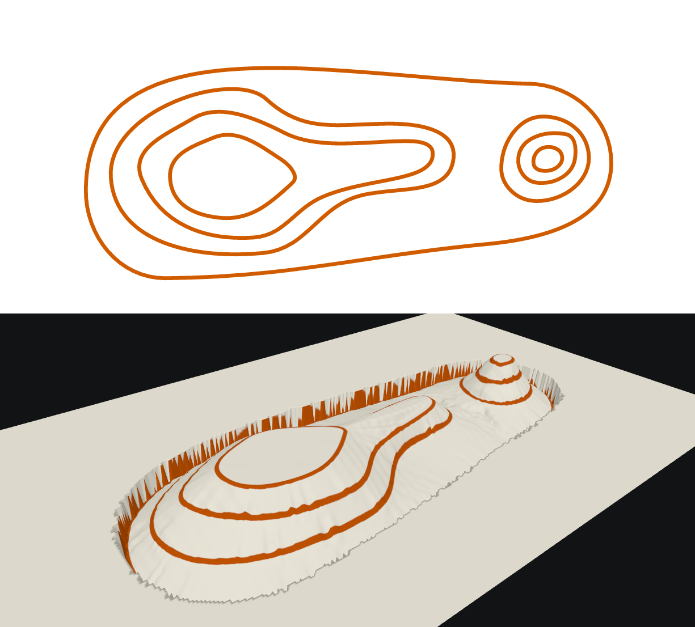
  <figcaption>On top the input map and on the bottom the 3D object computed by the algorithm</figcaption>
</figure>

## 1. Setting and notation

Let $\Omega \subset \mathbb{R}^2$ be the (bounded, rectangular) extent of the map.

A **contour** is a curve $\gamma_i : [0, L_i] \to \Omega$, parametrized by arc
length, $i = 1, \dots, n$ ($L_i$ its own total length), either closed or with two
distinct endpoints, coming from the map's *contour* and *form line* symbols. Each
contour carries a **step** $s_i \in \{1, \tfrac12\}$: $1$ for an ordinary contour,
$\tfrac12$ for a form line (Assumption 2, below).

At (almost) every point of $\gamma_i$ the tangent has two unit normals; exactly one of
them points toward lower ground. Call this the contour's **gravity field**
$\nu_i(t)$. Assumption 1 (below) guarantees $\nu_i$ is determined by a single global
sign $\sigma_i \in \{+1,-1\}$ relative to an arbitrary fixed choice of normal
orientation along the curve — i.e. a contour has one consistent downhill *side*, not
a side that can flip partway along it. Finding every $\sigma_i$ is the first goal;
finding every contour's **elevation** $h_i \in \mathbb{R}$ (in units of "contour
step", relative to one arbitrarily chosen reference contour) is the second.

Three further symbol families supply indirect evidence about $\sigma_i$ before it can
be measured directly:

- **Point evidence** (slope line symbols): an isolated point near a contour with a
  gravity direction already known.
- **Transverse line evidence** (jump symbols — cliffs, earth banks): a curve, itself
  crossing the contours, whose own gravity direction is already known.
- **Parallel evidence** (heavy-object symbols — gullies, watercourses): a curve that
  runs *along* the direction of steepest descent rather than across it, so it carries
  no gravity reading of its own; the neighboring contours' local curvature must be
  used to infer one (§3.2).

The map is discretized into a matrix $G$ of square cells of side $\delta$ covering
$\Omega$. Every cell takes one of four kinds of value:

$$
G(i,j) \in \{\,\mathrm{UNCLAIMED}, \mathrm{OUT},\ \mathrm{FREE},\ \mathrm{CONFLICT}\,\} \ \cup\ \{1,\dots, k, \dots, n\}
$$

- $\mathrm{UNCLAIMED}$: unclaimed part of the map
- $\mathrm{OUT}$: outside the map
- $\mathrm{FREE}$: inside it but on no contour
- $\mathrm{CONFLICT}$: on more than one
contour closer together than $\delta$ can distinguish (a genuine ambiguity, not an
error: it is simply left unresolved and treated as an obstacle everywhere else in the
algorithm)
- $k$: on contour $k$

$G$ is referred to below as the **reference matrix**.

Any segment (a piece of a contour, or a step of one of the sensing rays of §4) has a
well-defined **trace** on this grid: the set of cells whose interior it geometrically
intersects. This set is unambiguous — it does not depend on which method computes
it — so it is treated below as a primitive: given a segment, its trace is known. How
the trace is actually computed (a standard line/grid-traversal routine) is ordinary
computational geometry, unrelated to the contour-to-elevation problem itself, and is
left out of this account.

## 2. Assumptions

**Assumption 1 (one-sided gravity).** For every contour, the downhill side is the
same at every point along it: there is no contour with slope evidence pointing to
different sides at different points of the same curve.

**Assumption 2 (form lines are half-steps).** A form line drawn between two ordinary
contours always sits exactly halfway between them in elevation, regardless of the
two ordinary contours' actual spacing. Crossing into or out of a form line is
therefore always worth half the local equidistance, never a fraction depending on
geometry.

## 3. Overview of the five stages

### 3.1 Stage 1 — Building the reference matrix $G$

Initially $G$ is initialized with `UNCLAIMED` values, in this stage it's filled up.

Every contour is discretized (resampled to a polygonal curve of near-constant vertex spacing) and drawn into $G$ (with its id). Two contours landing in the same cell mark it `CONFLICT` rather than being arbitrarily assigned to one of them.

The `UNCLAIMED` area around or between the drawn contour is filled up with `FREE` values using §4 (there, the **Exploration**).

The complement of the map (outside its actual boundary) is found by flooding outward from $G$'s own border through every still-unclaimed cell.

<figure>
  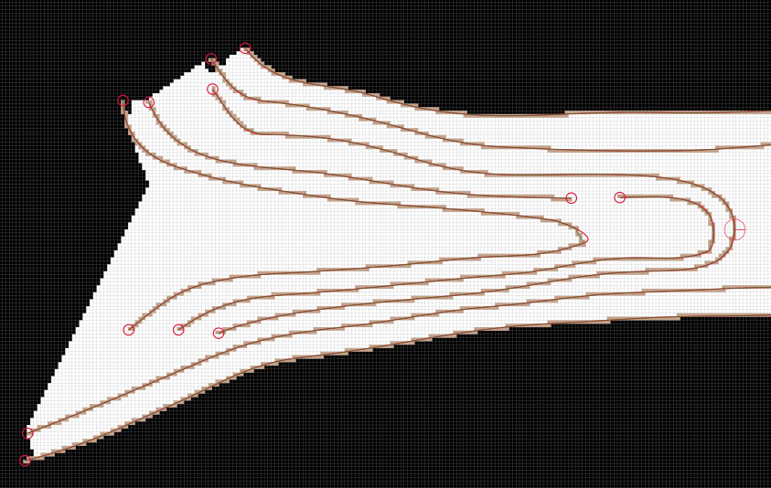
  <figcaption>In this image we can see in black the out of bound pixels flooded from the rectangular borders of Ω, the trace of each contours in brown and in white the free (in-bound) pixels. Here we present contours of different index with the same color: brown but they are actually writing different indexes into G.</figcaption>
</figure>

Line evidence (jumps) is also drawn into $G$: calling $\beta$ their curve, $\beta$ is thickened into
a band $\beta \oplus B_r$ using its *Minkowski sum* with a disk $B_r$ of prescribed
radius $r$. The band is then itself stamped as `CONFLICT`, since it represents real, locally jumbled terrain rather than a single well-defined slope.

Parallel evidence (heavy objects) is also thickened in the same way as line evidence but they are **not** drawn into *G*.

Point evidence (slope lines) are **not** drawn into $G$.

<figure>
  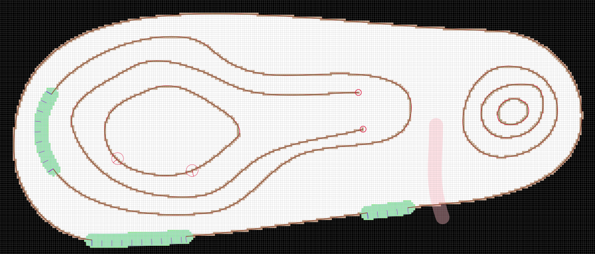
  <figcaption>Here we can see some line evidence drawn in light green (CONFLICT) into G with their gravity shown with purple segment, a parallel evidence band is shown in light red (not written into G) and point evidence are shown as red circles with a red radius pointing toward the gravity that they define (they are also not drawn into G).</figcaption>
</figure>

**Closing incomplete contours.** A digitized contour is not always a closed curve or
one that reaches the map's edge — mis-drawn or interrupted lines leave *dangling
ends*. Every such end is completed by a relaxation process: it is treated as a point
particle subject to an overdamped dynamic (velocity proportional to the local force,
no inertia) under a combination of

- a short-range potential centred on nearby contour cells — repulsive at very short
  range, mildly attractive beyond some equilibrium distance, saturating at long
  range, so a dangling end is neither swallowed by its own curve nor left free to
  wander arbitrarily far from it;
- a constant pull toward the map's boundary, toward an unresolved (`CONFLICT`) cell,
  and toward another dangling end.

The end moves until it reaches the boundary, a `CONFLICT` cell, or another dangling
end close enough to merge with (closing the contour into a ring, or splicing two
contour fragments into one). A short-range geometric pre-check (matching two ends
that are already close together, or already pointing straight at a boundary/conflict
region) is tried first, to avoid running the relaxation on cases that do not need it.

<figure>
  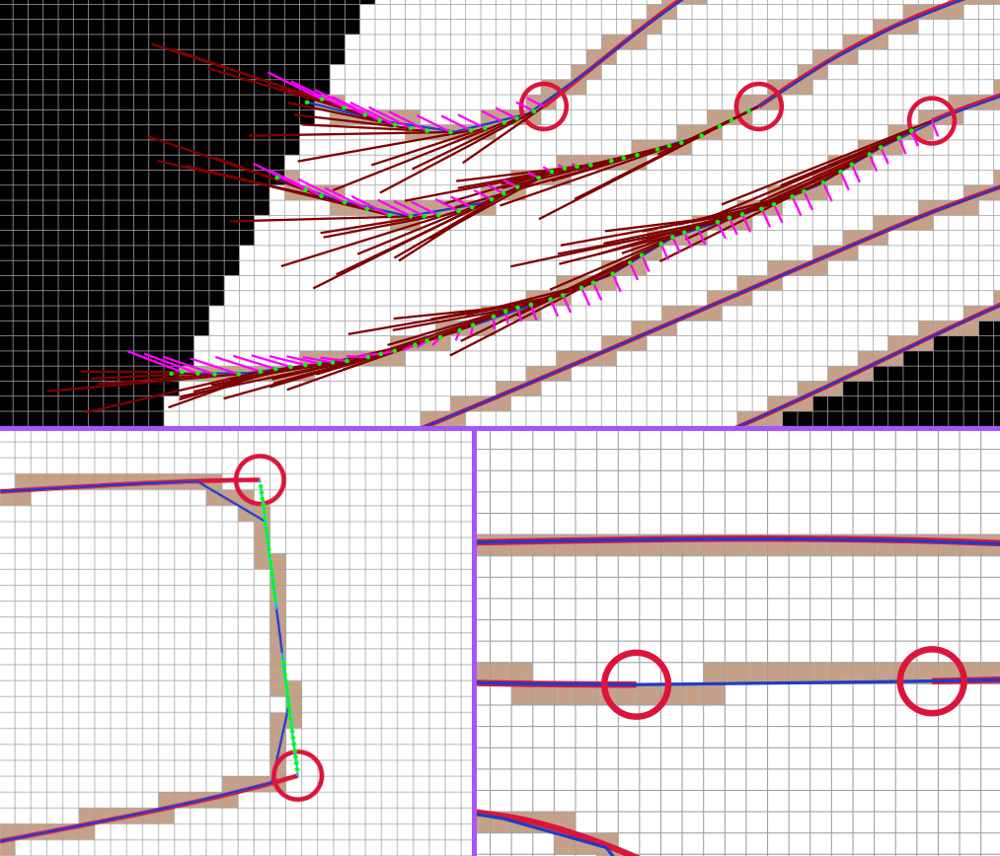
  <figcaption>Red circle shows dangling-ends. On top some dangling-ends close their contours against the out-of-bound area, on the bottom they find another dangling end to match with.</figcaption>
</figure>

At this point we discard all the contours with dangling-ends and we end up with a set of contours, each either closed or having their start or end position in a `OUT` or `CONFLICT` location.

### 3.2 Stage 2 — Direct gravity assignment

In this stage we define gravity for all the contours with an obvious gravity direction in the following resolution order:

1) Every contour touched by point evidence takes its sign $\sigma_i$ directly;
disagreeing evidence on the same contour is a contradiction and aborts the contour gravity assignation.
2) Every closed contour still without a sign, that does not enclose any other contour,
is assigned the conventional reading of an isolated hill: downhill points outward,
away from its own interior.
3) Every contour touching a line evidence gets its gravity from a vote across every
line evidence touching it, each weighted by how perpendicular its own gravity is to
the contour there.
4) Every contour touching a parallel evidence gets its gravity the same way, from a
vote across every such intersection. At an intersection, we take the point on the contours closeby the intersection, and we fit a
circle through them by least squares. The gravity is the direction from the
intersection to that circle's own centre. Each vote is weighted by the fitted circle radius, a bigger radius is less strong than a smaller one.

<figure>
  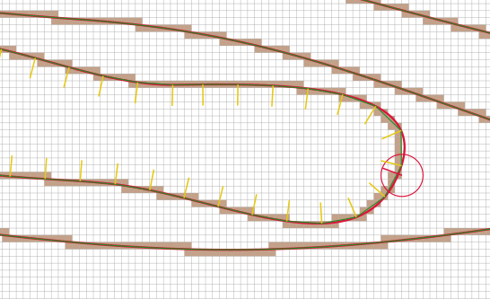
  <figcaption>A point evidence defining the gravity of a contour</figcaption>
</figure>
<figure>
  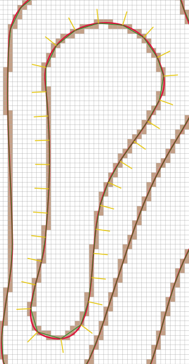
  <figcaption>A closed contour without any interior contour gets its gravity defined outward</figcaption>
</figure>
<figure>
  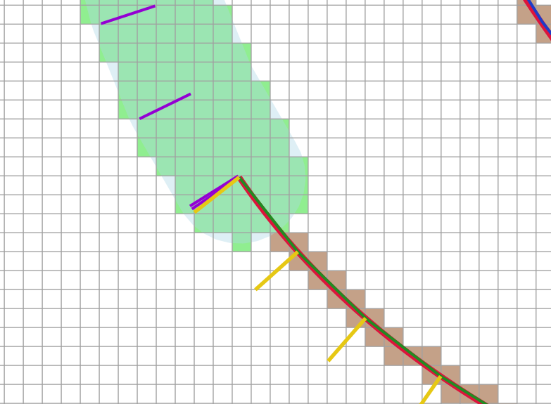
  <figcaption>A line evidence defining the gravity of a contour</figcaption>
</figure>
<figure>
  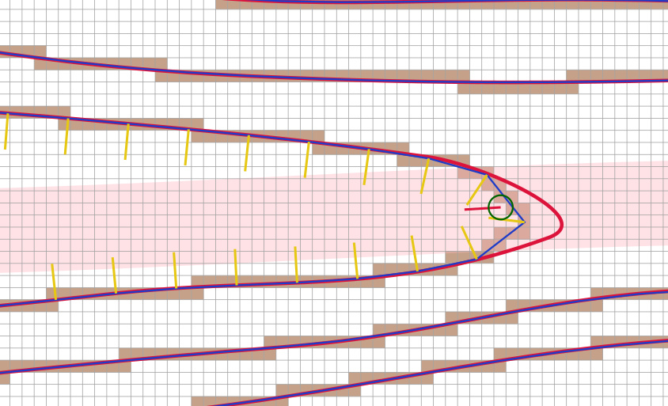
  <figcaption>A parallel evidence defining the gravity of a contour</figcaption>
</figure>

We conclude the stage having defined the gravity on some contours.

### 3.3 Stage 3 — Statistical gravity assignment

Contours not reached by Stage 2 have their sign inferred *statistically*, by the
generic sensing procedure of §4 (there, the **Cold** and **Anti Cold**
variants, launched *with* and *against* the source's own known gravity): many
sample points are seeded along contours whose sign is already known, and rays are
sent outward, perpendicular to the source curve. A ray passes straight through every
still-undetermined contour it meets, casting one vote on each for a hypothesis about
that contour's own sign, and stops at the first already-determined one; once enough rays have been cast, each still-undetermined
contour's sign is decided by majority. A near-tie is flagged rather than silently
resolved.

A second wave (the **Reverse Cold** variant), sourced from the *still-undetermined* contours themselves
(with no fixed sign to launch from, so both perpendicular directions are used),
lets a ray reaching an already-resolved contour report a vote back onto its own
point of origin instead. Any contour no ray ever reaches is left permanently
undetermined and is dropped, with a warning.

We end the stage having defined the gravity for every contour that was not dropped.

<figure>
  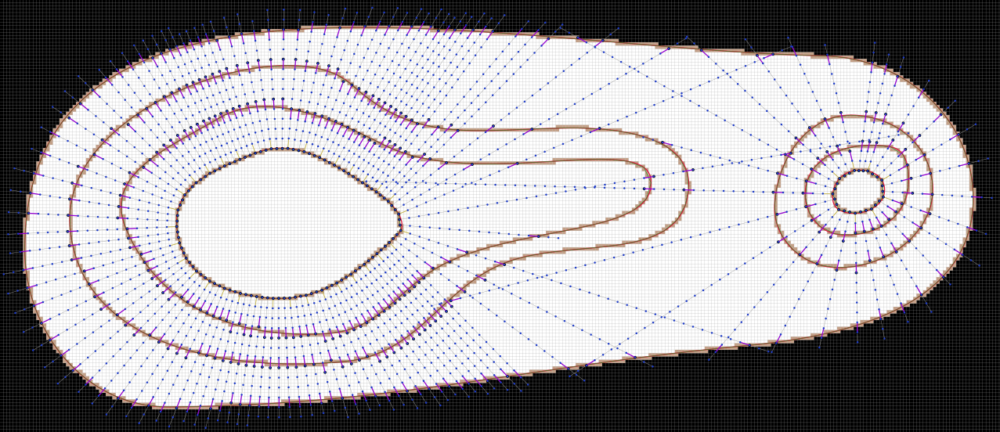
  <figcaption>A Cold Rain Drop. For each rain drop path (gray lines) all the steps of the rain drop are shown in blue. Purple segments show when the rain drop has voted.</figcaption>
</figure>

<figure>
  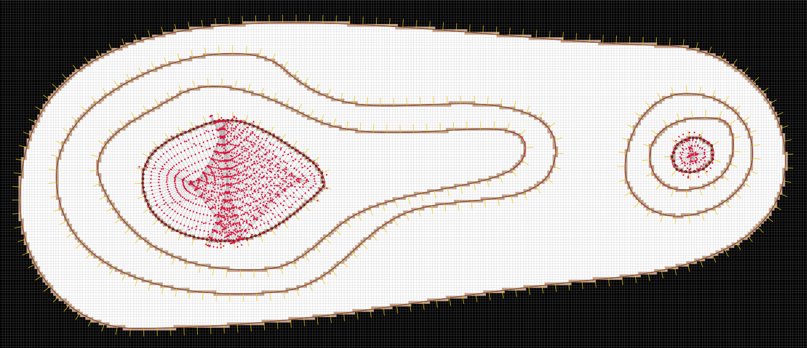
  <figcaption>An Anti Cold Rain Drop. For each rain drop path (gray lines) all the steps of the rain drop are shown in red. Purple segments show when the rain drop has voted.</figcaption>
</figure>

### 3.4 Stage 4 — Elevation propagation

One contour is chosen arbitrarily as the reference, $h = 0$. Elevation then
propagates outward from it along a growing tree $T$ of contours (a spanning
structure over the subset of contours reachable from the reference), using the same
generic sensing procedure of §4 (the **Hot** and **Anti Hot** variants:
launched *with* and *against* the source's own known gravity).

A ray reaching another contour proposes an elevation for it: one step lower if the
ray travelled with gravity and the crossing is consistent with the target's own
sign, unchanged (or one step higher, for the reverse direction) otherwise — the
step being $\min(s_{\text{source}}, s_{\text{target}})$, i.e. a half-step whenever a
form line is involved (Assumption 2). Because a single ray's reading is unreliable
exactly where its direction is close to perpendicular to the target's own gravity,
every ray reaching a given contour during one propagation round casts a *weighted*
vote instead of deciding anything immediately — weight $|\cos\theta|$, the alignment
between the ray's direction and the target's local gravity — and only once the
round is complete, and only if the combined weight clears a minimum threshold, is
the vote turned into a decision.

Propagation proceeds breadth-first: at each round, the still-unexhausted node of
$T$ nearest the root is expanded. If two different rounds propose conflicting
elevations for the same contour, the assignment representing the larger distance
(in steps) from the reference is kept and the other is discarded together with
its own subtree, to be re-attached later if some other round reaches it again. The
process ends when no further contour can be reached; anything never reached is
disconnected from the evidence entirely and is dropped, with a warning naming it.

<figure>
  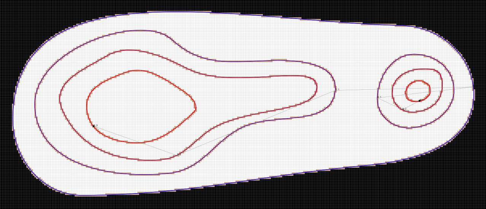
  <figcaption>The outer contour defines the elevation of all the others in a tree structure</figcaption>
</figure>

### 3.5 Stage 5 — Synthesizing the elevation matrix

A second matrix $E$, at the same resolution $\delta$ as $G$, is seeded with each
contour's own elevation on the cells $G$ assigns to it. The band between two
elevations is then filled by the generic sensing procedure once more (the
**Elevation Fill** variant, §4): a ray from a source contour, travelling with
gravity, marks every cell it crosses with a value linearly interpolated between the
two elevations at either end, weighted by the *distance to the far end* — so a cell
near the source reads close to the source's own value. Since a cell is typically
crossed by several such rays, its final value is a weighted average over all of
them, each ray's contribution weighted inversely by its own total length (a short,
locally-confident ray is trusted more than a long one crossing an open, sparsely
contoured area).

Cells no ray ever reaches — chiefly a hilltop's own interior and anything past a
map-edge contour's outward side — are filled last, by repeated local averaging:
every unfilled cell adjacent to at least one filled cell is set to the mean of its
filled neighbours, and this is repeated until nothing changes. This is a discrete,
purely local extension (closer to a nearest-value fill than to an extrapolated
peak) and is understood as the simplest option, not a final one.

Every value up to this point is a *count of contour steps* relative to the
arbitrary reference chosen in Stage 4 — not a physical unit. The very last operation
of the whole algorithm is a single multiplication of $E$ by the map's known
equidistance (the true vertical spacing between two adjacent ordinary contours, in
metres), turning the step count into an elevation in metres, still relative to that
same unknown baseline.

<figure>
  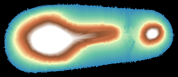
  <figcaption>Each element of $E$ has an elevation defined from the contours values.</figcaption>
</figure>

## 4. The generic sensing procedure ("rain drop")

Every simulated-particle computation in Stages 1, 3, 4 and 5 is one instance of the
same template, differing only in three independent choices: where it starts and
which direction it leaves in, what stops it, and what happens at the stop.

**Source placement and direction.** Given a contour, a fixed number of points are
placed along each of its segments, evenly spaced; each point's own launch direction
is the local perpendicular to the curve, interpolated between the directions
computed at the segment's two endpoints (a node's own direction being the average of
its two adjacent segments' perpendiculars). A source with a known gravity field
launches either *with* it or *against* it; a source with no gravity yet (used only
in Stage 1, where none has been computed at all) launches in an arbitrary but fixed
side, with the opposite side always covered by a paired run — so which side was
arbitrary never matters to the result.

**Stepping.** A particle advances in a straight line, a fixed small distance at a
time, from its source and in its fixed direction, for as long as it is not stopped.

**Stopping rule and action.** At each step the particle's path is tested against the
current state of $G$: has it left the map, has it entered a `CONFLICT` cell, or has
it reached some contour? Which of these actually stops the particle, and what
happens at that moment, is what distinguishes one use of the procedure from
another:

| Variant | Used in | Stops on an *undetermined* contour? | Stops on its own source contour? | Action at the stop |
|---|---|---|---|---|
| Exploration | building $G$ | — (no contour has a sign yet) | no, within a short grace window | marks the crossed cells as "in bound, no contour" once it stops cleanly on a contour/conflict, discards its whole path if it stops on the boundary instead |
| Cold / Anti Cold | Stage 3 | no — passes through, casting one vote for a downhill side on it | no, within a short grace window (and again for a short window after each vote) | none: stops on a *determined* contour, the boundary or `CONFLICT` without further effect |
| Reverse Cold | Stage 3 | no — passes through silently | not applicable (this variant is only ever sourced from undetermined contours) | on a *determined* contour: casts one vote back onto its own source |
| Hot / Anti Hot | Stage 4 | stops on any contour | no, within a short grace window | casts a weighted elevation vote on the contour it stops on |
| Elevation Fill | Stage 5 | stops on any contour, or on `CONFLICT` | no, within a short grace window | deposits an interpolated elevation value on every cell it crossed |

Every variant that would otherwise stop right at its own point of origin is exempt
from doing so for a short initial stretch — long enough to clear the source curve's
own immediate neighborhood, no longer — since a source contour concave enough to be
re-crossed later in a particle's life must still be able to stop it then, exactly
like any other contour.
