# Known Bugs

## Tested benchmarks

Three benchmarks are public and reproducible from what's in this repository
(a fourth, over a private real map dataset, is not — see
[Real map dataset](#real-map-dataset) below). All three follow the same
pattern: build the archive with `create_benchmark`, then run it with
`benchmark`. See [README.md](../README.md#usage) for what the options mean.

**The two sample maps**, rendered whole rather than split by symbol:

```bash
./target/release/create_benchmark /path/to/map_to_image maps/ --filter sample -o benchmarks/benchmark_sample_maps_3_px_m.zip
./target/release/create_benchmark /path/to/map_to_image maps/ --filter sample -r 6 -o benchmarks/benchmark_sample_maps_6_px_m.zip
./target/release/benchmark benchmarks/benchmark_sample_maps_3_px_m.zip
./target/release/benchmark benchmarks/benchmark_sample_maps_6_px_m.zip
```

**ISOM 2017-2 (`maps/ISOM_10k.omap`, a 1:10000 map), split one map per
symbol:**

```bash
./target/release/create_benchmark /path/to/map_to_image maps/ISOM_10k.omap
./target/release/create_benchmark /path/to/map_to_image maps/ISOM_10k.omap -r 6
./target/release/benchmark benchmarks/benchmark_ISOM_10k_3_px_m.zip
./target/release/benchmark benchmarks/benchmark_ISOM_10k_6_px_m.zip
```

**ISSprOM 2019 (`maps/ISSprOM_4k.omap`, a 1:4000 sprint map), split one map
per symbol:**

```bash
./target/release/create_benchmark /path/to/map_to_image maps/ISSprOM_4k.omap
./target/release/create_benchmark /path/to/map_to_image maps/ISSprOM_4k.omap -r 6
./target/release/benchmark benchmarks/benchmark_ISSprOM_4k_3_px_m.zip
./target/release/benchmark benchmarks/benchmark_ISSprOM_4k_6_px_m.zip
```

`/path/to/map_to_image` is the external ground-truth renderer — see
[ground truth renderer](../README.md#ground-truth-renderer) for what that needs to be.
Both resolutions (3 and 6 pixels per meter) were run over each suite; the
images below are picked from whichever run happened to show them, at
either resolution.

## Known Bugs

### ISOM/ISSprOM per-symbol benchmark

#### Bugs

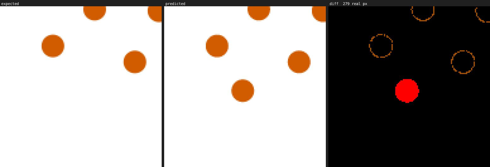
*ISOM per-symbol benchmark — area 113 Broken ground, one cell of the rotated
fill-pattern grid: one extra dot is rendered, the two empty orange
circles nearby are ordinary antialiasing.*

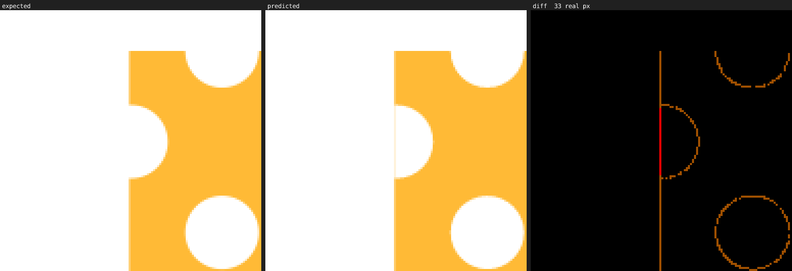
*ISOM per-symbol benchmark — area 402 Open land with scattered trees: an extra yellow 1 px thick line is rendered.*

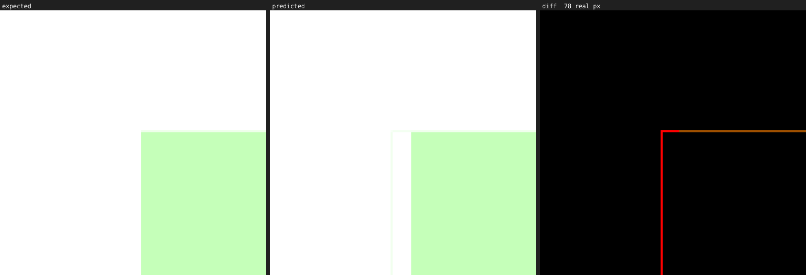
*ISOM per-symbol benchmark — area 406.1 Vegetation (slow running / normal
running in one direction): an extra green 1 px thick line is rendered.*

#### Non Bugs

Differences we don't think are worth caring about — extreme corner cases
that don't come up on a real map.

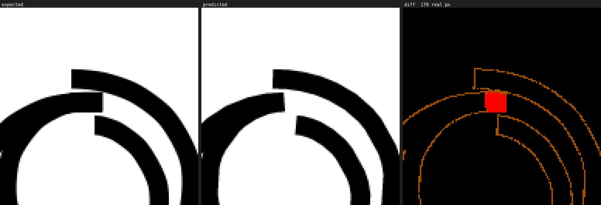
*ISOM per-symbol benchmark — line 511.1 / combined 511.2 Major power line
(with large carrying masts): a shorter line is rendered in an extreme corner case.*

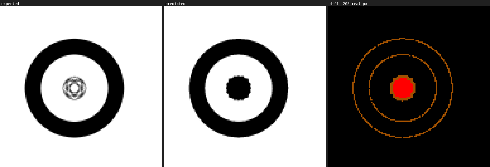
*ISOM per-symbol benchmark — line 511 Major power line, at its minimum
length: different behaviour when one of the two parts of a power line is collapsing in a circle.*

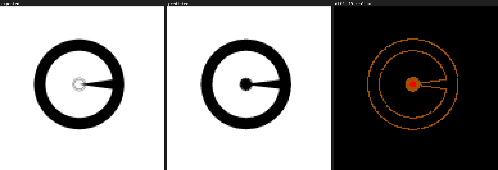
*ISOM per-symbol benchmark — combined 509 Railway, at its minimum length: different behaviour when one of the symbol's borders collapses on itself*

#### Improvements

Cases where MaUR-O's own rendering looks more correct than the ground
truth's, in our opinion.

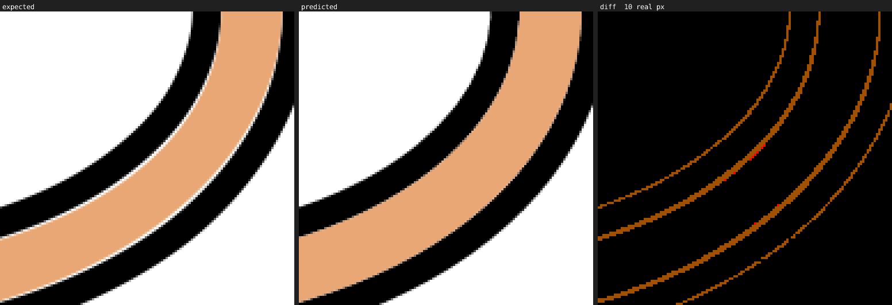
*ISOM per-symbol benchmark — line 502 Wide road, minimum length case, at a
tight bend: OMapper inserts a non coloured space between the road border and the road itself, MaUR-O does not. This is not a corner case but a well-known OMapper issue.*

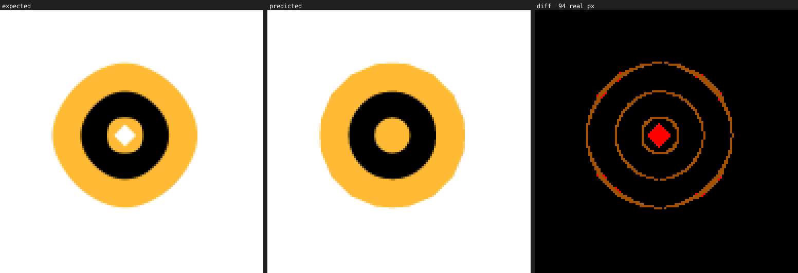
*ISOM per-symbol benchmark — combined 508.1 Narrow ride, easy running,
center dot: the ground truth leaves a small unfilled white diamond inside
the black center dot; MaUR-O fills it solid.*

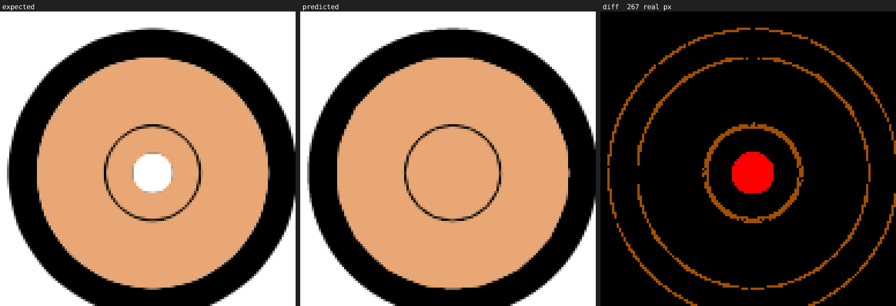
*ISOM per-symbol benchmark — combined 502.2 Road with two carriageways,
rotation grid cell: the ground truth leaves a thin unfilled white ring
inside the fill; MaUR-O fills it solid.*

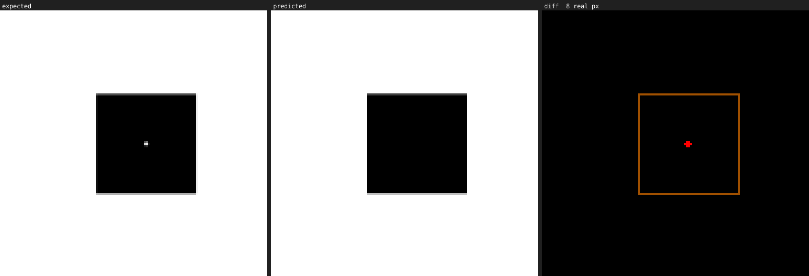
*ISOM per-symbol benchmark — combined 521.2 Large building with outline:
the ground truth leaves a stray one-pixel white speck inside the solid
fill; MaUR-O's fill has none.*

### Real map dataset

Found running the benchmark over a private dataset of real,
orienteering maps (not included in this repository).

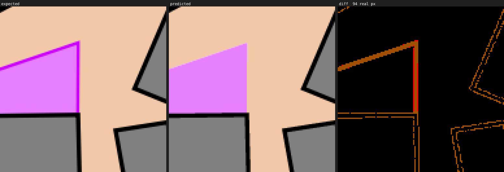
*Real map dataset: the edge of a purple symbol is missing.*

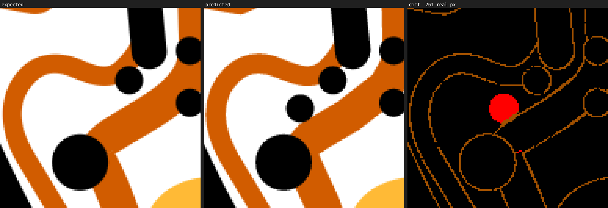
*Real map dataset: extra rendering of a black dot of a stony area.*

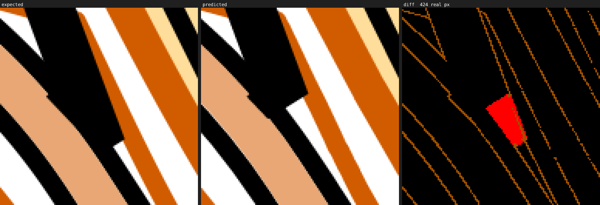
*Real map dataset: a 180-degree turn of a path is shortly rendered.*

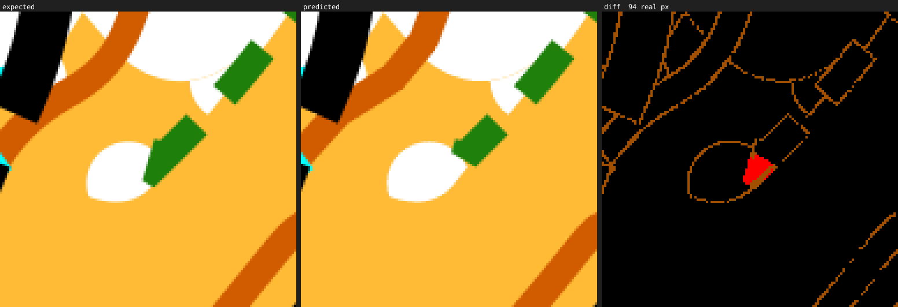
*Real map dataset: same as before but with a distinct vegetation boundary.*

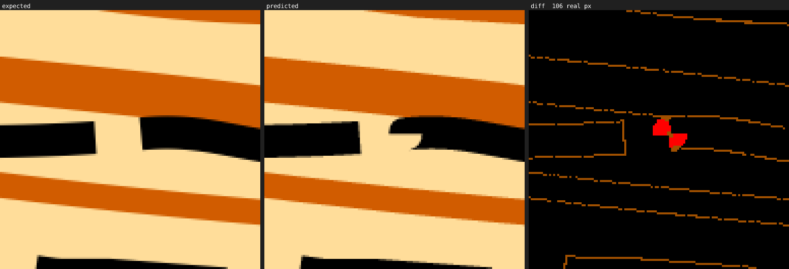
*Real map dataset: a small notch in a black area's boundary near a track
junction doesn't match the ground truth's curve.*

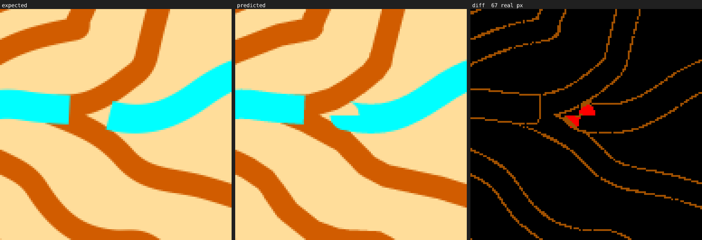
*Real map dataset: a render issue in the dash of a seasonal water channel.*
